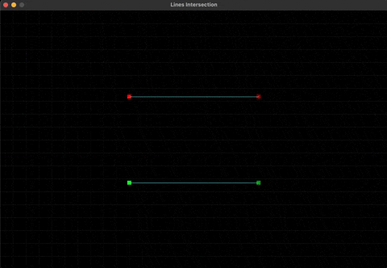
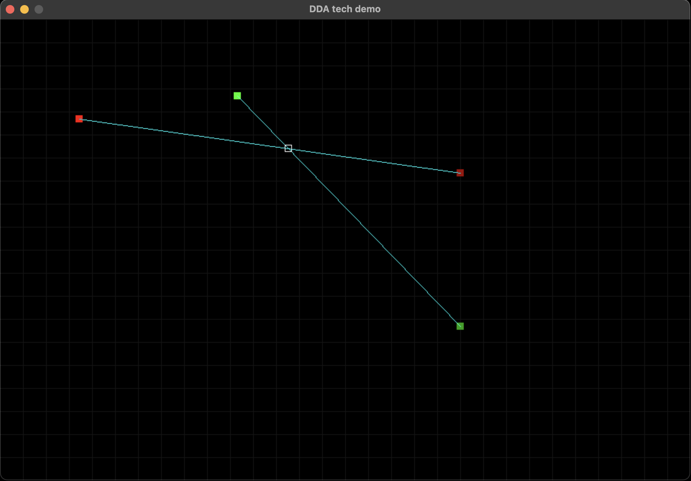

# lines-intersection
2 Lines intersection implementation with visualization.

Controls to move points:
  - WASD
  - LEFT SHIFT + WASD
  - ARROW KEYS
  - LEFT SHIFT + ARROW KEYS

Sources:
  - https://www.topcoder.com/thrive/articles/Geometry%20Concepts%20part%202:%20%20Line%20Intersection%20and%20its%20Applications

